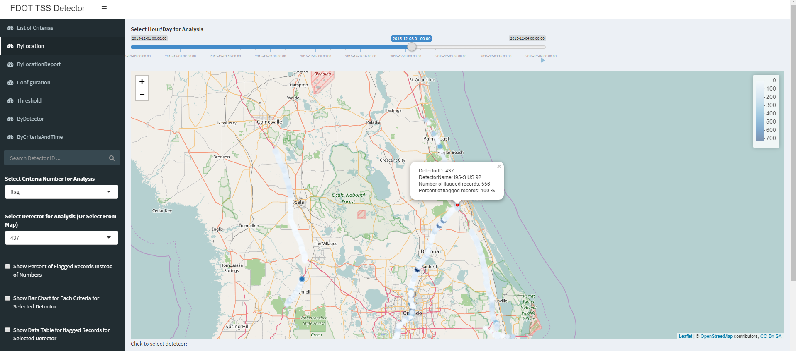

---  
title: "Readme"
output: 
  md_document:
    variant: markdown_github
---

```{r setup, include=FALSE}
knitr::opts_chunk$set(echo = TRUE)
```

# Overview

This project is based on Sunguide Traffic Surveillance System data from Florida. A supplementary data dashboard for visualization purpose can be accessed here: [Link for Dashboard](https://shiwang0211.shinyapps.io/Dashboard_20161206/). Raw data are not included in this repository.

The analysis include:

* Visualize potential failure of detectors on map
* Generate report tables and graphs for several performance metrics

The packages used for the analysis include [leaflet](https://rstudio.github.io/leaflet/), [ggplot](http://ggplot2.tidyverse.org/index.html), [plotly](https://plot.ly/r/), [data.table](https://github.com/Rdatatable/data.table), etc.

Below is an Illustration of the dashboard for study area and initial results.



# Contact

Shi Wang (<shiwang0211@gmail.com>)
